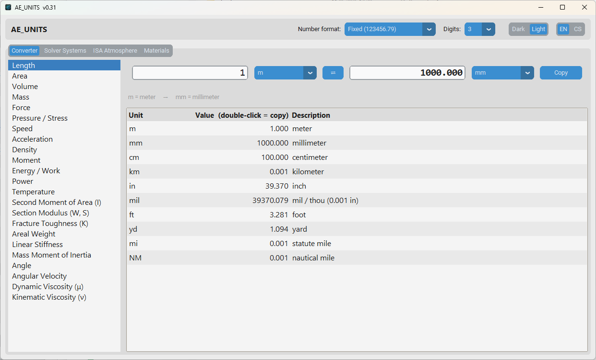

# AE_UNITS

Desktop utility for aerospace engineers and designers. Replaces ad-hoc Google searches for unit conversions, atmospheric data, and FEM/CFD solver unit systems. Bilingual — CS / EN.

[](https://github.com/mrSpringpeace/AE_UNITS/actions/workflows/tests.yml)




---

## Features

### Unit Converter
21 categories, ~120 units — SI and imperial, covering the units found in Niu and Bruhn literature.

Live recalculation as you type. Entire table of all units updated at once — one glance answers "100 KTAS = ? m/s = ? km/h = ? ft/s". Double-click any table row to copy the value.

| Category | Notable units |
|---|---|
| Length | m, mm, in, ft, NM |
| Speed | m/s, kt (KTAS/KIAS/KEAS), ft/min, mph |
| Pressure / Stress | Pa, MPa, psi, ksi, psf, kgf/mm² |
| Force | N, kN, lbf, kip, kgf |
| Mass | kg, slug, slinch (lbf·s²/in) |
| Density | kg/m³, t/mm³ (Abaqus), lb/in³, slug/ft³ |
| Second Moment of Area | m⁴, mm⁴, in⁴ |
| Fracture Toughness | MPa·√m, ksi·√in |
| Areal Weight | kg/m², g/m², oz/yd² (fabric) |
| Temperature | K, °C, °F, °R |
| … and more | moment, energy, power, viscosity, spring stiffness, angular velocity… |

### Solver Unit Systems
Pick a solver → see consistent unit system combinations with reference material values:

- **Abaqus** — SI (m), SI (mm/t/s), US (in/slinch), US (ft/slug)
- **Nastran** — same + `WTMASS` note for lb/in³ density models
- **OpenFOAM** — SI only; note on kinematic pressure p/ρ for incompressible solvers
- **PAM-CRASH** — (mm/g/ms) → MPa and (mm/kg/ms) → GPa crash systems

Each table includes reference material properties (steel, aluminium) in every unit system.

### ISA Atmosphere
US Standard Atmosphere 1976, 0–86 km geometric altitude.

- Input: altitude in m / ft / km / FL, optional ΔISA offset
- Output: T, p, ρ, speed of sound (m/s + kt), dynamic and kinematic viscosity, σ, δ, θ, **1/√σ** (TAS↔EAS conversion factor)

### Materials Reference
19 common aerospace materials with **SI and imperial side by side**, full-text search, and user-editable library:

Al 2024-T3, 6061-T6, 7075-T6, 7050-T7451 · Mg AZ31B · Ti-6Al-4V, Ti Grade 2 · Steel 4130, 4340, 17-4PH, 304 · Inconel 718 · C/epoxy UD and fabric · E-glass/epoxy · Sitka spruce · Birch ply · Rohacell 51 IG

Add your own materials — saved automatically to `user_materials.json`. Export/import JSON libraries to share with colleagues.

> ⚠️ Indicative typical values only. For structural substantiation use MMPDS / CMH-17 or the material data sheet.

---

## Installation

**Requirements:** Python 3.11+, Windows

```bash
pip install customtkinter
python main.py
```

### Standalone executable (no Python required)
Pre-built `.exe` releases are available on the [Releases](../../releases) page.

To build yourself:
```bash
pip install pyinstaller pillow
python -m PyInstaller --onefile --noconsole --icon=icon.ico --add-data="icon.ico;." main.py
```

---

## Project structure

```
AE_UNITS/
├── main.py
├── core/
│   ├── units.py           # unit definitions and conversion engine
│   ├── isa.py             # ISA 1976 atmosphere model
│   ├── formatting.py      # global number format state
│   ├── i18n.py            # localization engine (CS / EN)
│   ├── settings.py        # persistent user settings (settings.json)
│   └── user_materials.py  # custom material persistence
├── data/
│   ├── solver_systems.py  # FEM/CFD unit system tables
│   └── materials.py       # built-in material database
├── lang/
│   ├── cs.py              # Czech UI strings
│   └── en.py              # English UI strings + quantity map
├── gui/
│   ├── app.py             # main window, toolbar (format, theme, language)
│   ├── theme.py           # dark/light palette for native Tk widgets
│   ├── tab_converter.py
│   ├── tab_solvers.py
│   ├── tab_isa.py
│   ├── tab_materials.py
│   └── dialog_material.py
├── docs/
│   └── screenshot.png
└── tests/
    ├── test_units.py      # 26 reference checks + roundtrip all units
    └── test_isa.py        # validated against US 1976 tables
```

---

## Conversion accuracy

All conversion factors are exact SI / NIST 2019 values where defined:

| Factor | Value |
|---|---|
| 1 in | = 0.0254 m (exact) |
| 1 lb | = 0.45359237 kg (exact) |
| 1 lbf | = 4.4482216152605 N (exact) |
| g₀ | = 9.80665 m/s² (exact) |

The test suite checks 26 known values from aerospace literature (Niu, Bruhn) and runs a roundtrip test across all units in all categories.

---

## Roadmap

- [ ] Dynamic pressure calculator (q = ½ρV²) from ISA + airspeed
- [ ] ISA atmosphere profile plot
- [ ] More materials (further Al alloys, CFRP layups)
- [ ] Export table to CSV

---

## License

MIT
